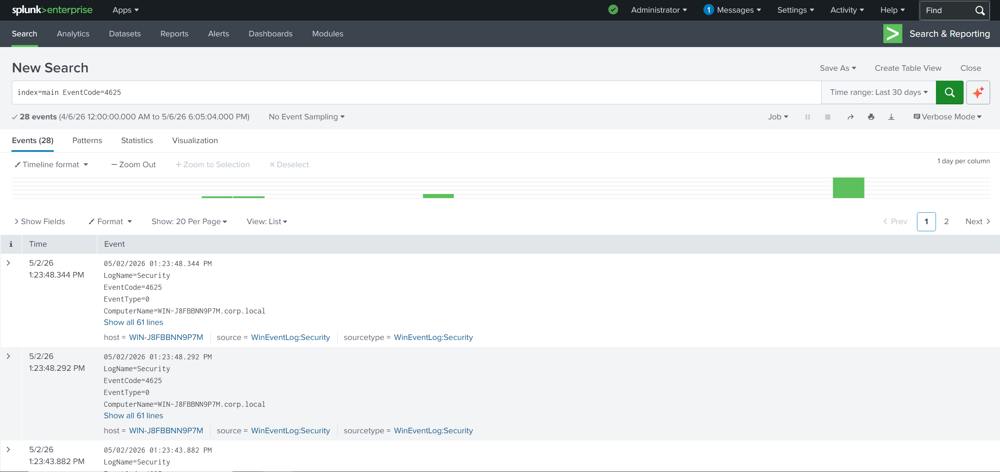
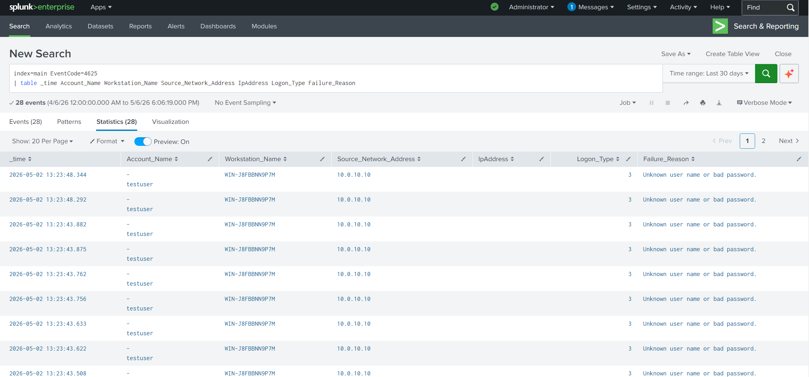
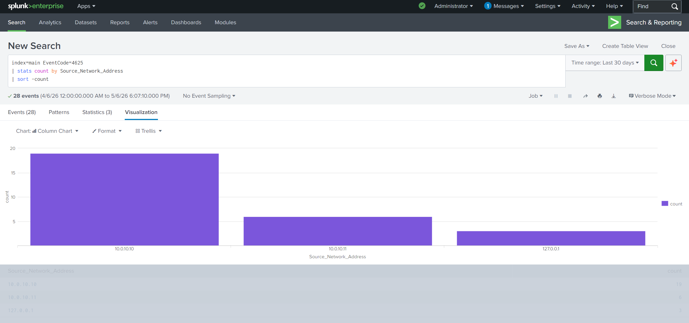
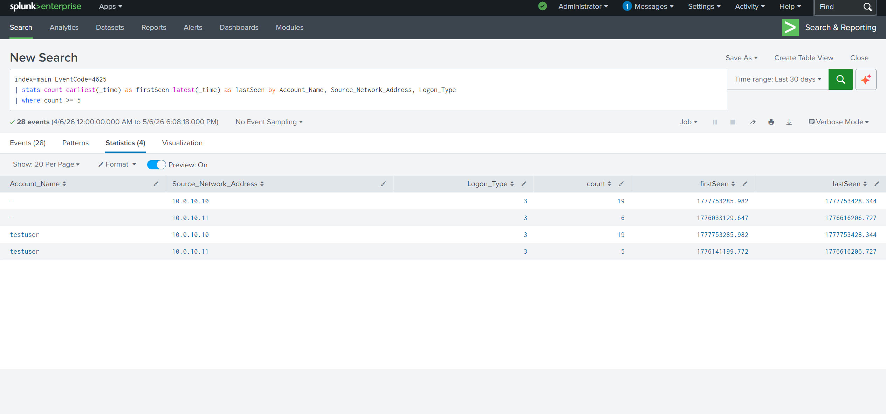

# Network Infrastructure & Security Monitoring Lab

## Overview

This project documents a virtual IT infrastructure lab built with pfSense, VMware, Windows Server, Windows 11, and Splunk. The goal of the lab was to practice network segmentation, DNS/DHCP configuration, Active Directory domain connectivity, Windows log collection, and basic authentication monitoring.

The lab simulates a small internal network where a Windows Server provides domain services and a Windows 11 client joins the domain. Splunk was used to centralize Windows Security logs and analyze authentication events such as failed logons.

## Lab Environment

- VMware
- pfSense
- Windows Server
- Windows 11 Client
- Active Directory Domain Services
- DNS / DHCP
- Splunk Enterprise
- Splunk Universal Forwarder

## Network Design

The lab used pfSense to separate WAN and LAN traffic and provide internal network routing. The Windows Server was configured with a static IP address and used for domain services, DNS, and authentication. The Windows 11 client was connected to the internal LAN and joined to the domain.

Example internal network:

```text
WAN / Internet
     |
  pfSense
     |
LAN: 10.0.10.0/24
     |
Windows Server: 10.0.10.10
Windows 11 Client: DHCP / Domain Joined
Splunk Server: Log Monitoring
```

## What I Configured

- Deployed a segmented virtual network using pfSense
- Configured DNS and DHCP services for internal client connectivity
- Joined a Windows 11 client to the Active Directory domain
- Enabled Windows audit logging for authentication events
- Installed and configured Splunk Universal Forwarder
- Ingested Windows Security logs into Splunk
- Created Splunk searches to identify failed login activity


## Splunk Log Monitoring

Splunk was configured to collect Windows Security logs from the lab environment. This allowed authentication events to be searched, filtered, and visualized.

One of the main event codes analyzed was:

- `4625` = failed logon attempt

## Failed Logon Search

```spl
index=main EventCode=4625
| table _time Account_Name Workstation_Name Source_Network_Address IpAddress Logon_Type Failure_Reason
```

This query displays failed logon attempts with key fields such as the account name, workstation name, source network address, logon type, and failure reason.


## Brute Force Detection Query

```spl
index=main EventCode=4625
| stats count earliest(_time) as firstSeen latest(_time) as lastSeen by Account_Name, Source_Network_Address, Logon_Type
| where count >= 5
| convert ctime(firstSeen) ctime(lastSeen)
| sort -count
```
This query identifies repeated failed logon attempts by grouping events by account, source network address, and logon type. In the lab, this helped identify repeated authentication failures from a single internal source.

## Dashboard Visualization

A Splunk dashboard panel was created to show failed logons by source network address.

```spl
index=main EventCode=4625
| stats count by Source_Network_Address
| sort -count
```

This visualization made it easier to quickly identify which source generated the most failed authentication attempts.

## Troubleshooting Performed

During the lab, I diagnosed and resolved several common IT infrastructure issues, including:

- IP addressing problems
- DNS misconfigurations
- Domain join issues
- Windows client connectivity problems
- Missing or inconsistent authentication logs
- Splunk log ingestion verification

## Screenshots

### Splunk Log Ingestion


Splunk successfully ingesting Windows Security logs from the lab environment.

### Failed Logon Events


Search results showing failed logon attempts (Event ID 4625).

### Failed Logons by Source


Visualization of failed logon activity grouped by source network address.

### Brute Force Detection


Search used to identify repeated failed authentication attempts that may indicate brute force activity.

## Key Takeaways

This lab helped me practice core IT infrastructure skills in a realistic virtual environment. I gained hands-on experience with network segmentation, domain connectivity, DNS/DHCP troubleshooting, centralized log collection, and Windows authentication monitoring.

The most important takeaway was learning how infrastructure issues and authentication events can be investigated using both system tools and centralized log data.


